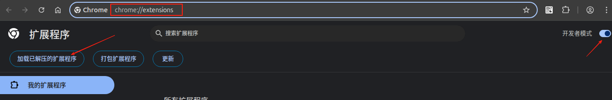
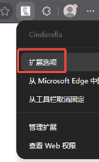
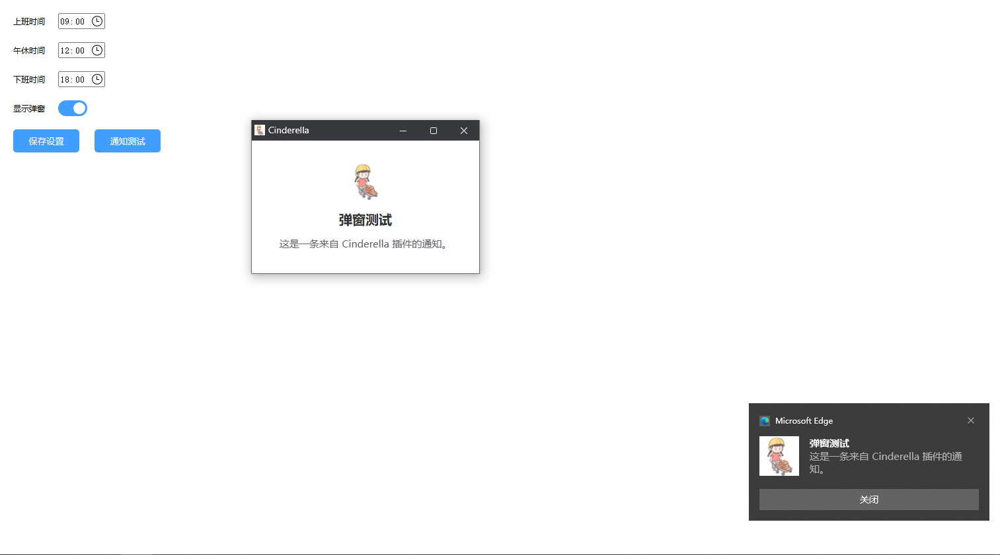

# ⏰ 公主请下班

一个提醒你准时下班、拒绝工作忘我的浏览器插件。

有时候不是不想下班，而是忙着忙着就忘了时间。这个插件会在整点提醒你距离下班还有多久，让你在专注工作的同时，也别忘了看看时间。

## ✨ 功能简介
- 🕐 整点提醒：每到整点提醒距离下班还有多久，避免工作到忘记时间。
- 🔔 轻量提醒：不打扰正常工作，只在需要的时候提醒你。
- 🍙 按时吃饭：人是铁，饭是钢，一顿不吃饿得慌！
- 🌙 拒绝加班：时刻提醒自己，工作是做不完的，但下班时间是可以准时到的。

## 🎯 为什么做这个插件？

程序员/打工人经常会遇到这种情况：

“我就再改一下这个问题。”

然后……

“怎么已经 23 点了？”

于是做了这个小插件，希望在每天忙得忘记时间的时候，能够有人提醒你：

该下班了。

## 🖥️ 使用方式

Chrome 安装插件后，设置你的工作时间和下班时间即可。

插件会在工作期间显示下班倒计时，并在整点进行提醒。

### 安装插件

1. Chromium 系浏览器地址栏输入 `chrome://extensions/` 打开插件管理界面，打开 <kbd>开发者模式</kbd> 开关，

2. 点击 <kbd>加载已解压的扩展程序</kbd>，选择该插件（或直接将该插件文件夹拖入）即可。

### 修改配置

1. 点击插件图标，点击 <kbd>选项</kbd>，Edge 是 <kbd>扩展选项</kbd>，

2. 进入 Cinderella 插件设置页面，可以设置上下班时间（默认是早 9 午 12 晚 18）。

3. 使用该插件需要打开操作系统的通知权限，可通过测试按钮检测是否能正常显示通知。

## 💡 Philosophy

专注工作很重要，准时下班也很重要。希望这个小工具能帮你少一点“忘我工作”，多一点“到点下班”。

认真工作，准时下班。

𝓦𝓸𝓻𝓴 𝓱𝓪𝓻𝓭. 𝓛𝓮𝓪𝓿𝓮 𝓸𝓷 𝓽𝓲𝓶𝓮. 🏃‍♂️