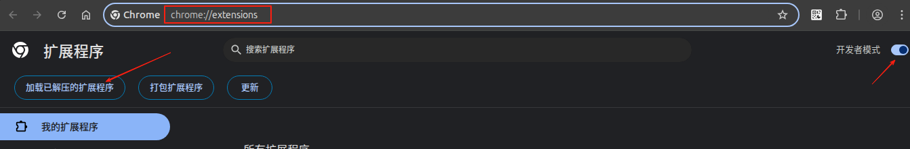

## 公主请下班

### 功能简介

- 早上 09:00，中午 12:00 以及下午 18:00 会弹窗通知。
- 整点时会弹窗显示下班倒计时。

### 安装说明

Chromium 系浏览器地址栏输入 `chrome://extensions/` 打开插件管理界面，打开 <kbd>开发者模式</kbd> 开关，

点击 <kbd>加载已解压的扩展程序</kbd>，选择该插件。

点击插件图标，点击 <kbd>选项</kbd>，

进入 Cinderella 插件设置页面，可以设置上下班时间（默认是早 9 午 12 晚 18）。

使用该插件需要打开操作系统的通知权限，可通过测试按钮检测是否能正常显示通知。

